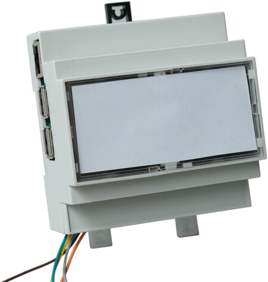
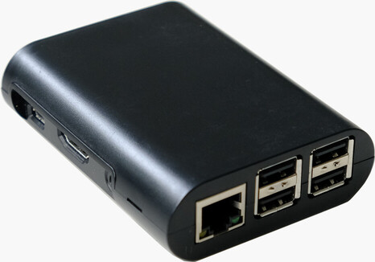
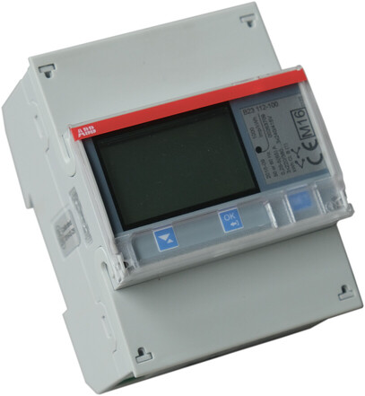
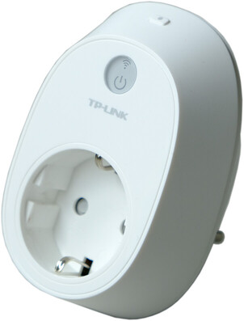
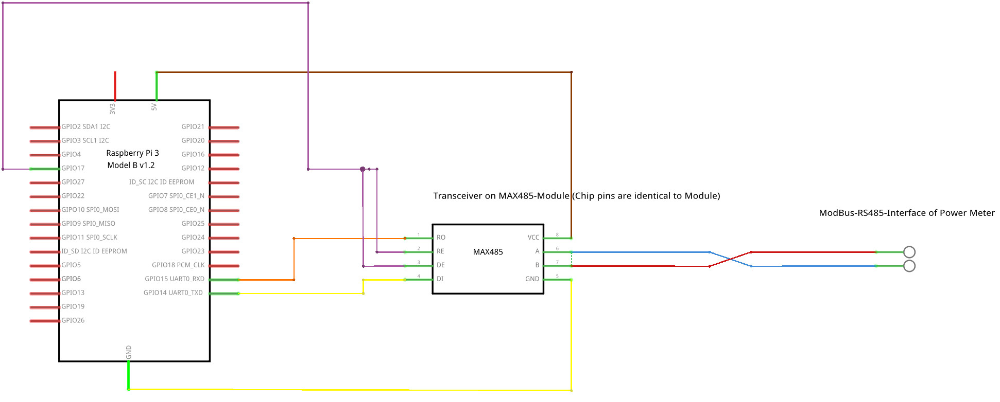
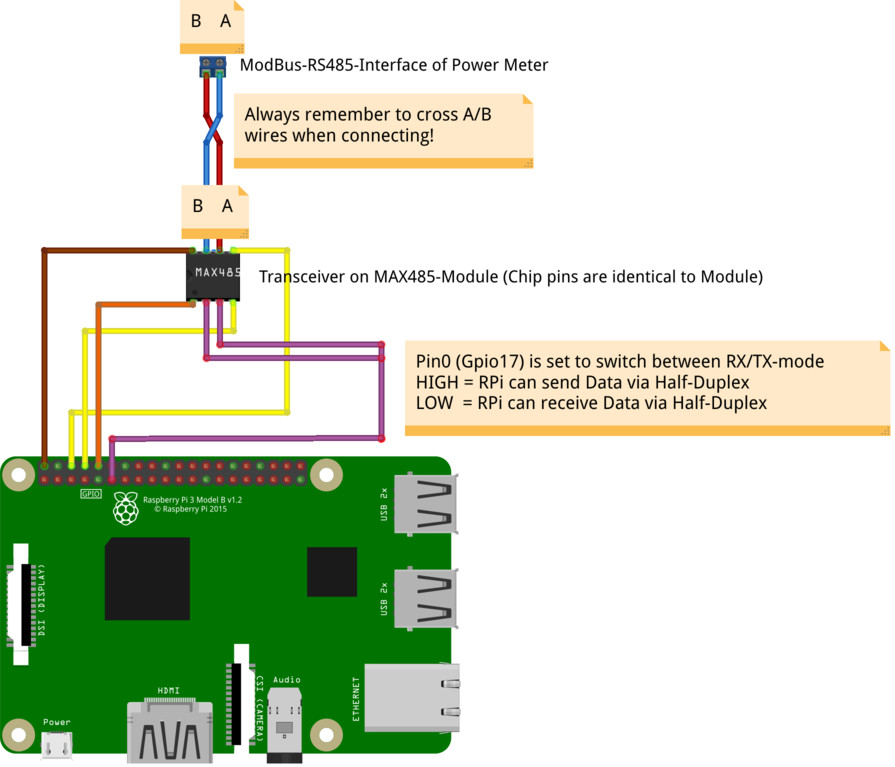

# BBOX: Domestic Energy Monitoring System - Client
This is the client side of the distributed domestic energy collection system used to collect the DEDDIAG dataset.

The system is to be used with a central [Energy-Server](https://github.com/DEDDIAG/energy-server).

For a general overview  of the Domestic Energy Monitoring System see [deddiag.github.io](https://deddiag.github.io).

bbox is based on Eclipse Smarthome and designed to run on an [Raspberry Pi 3 Model B+](https://www.raspberrypi.org/products/raspberry-pi-3-model-b-plus/) that collect data using [TP-LINK HS110](https://www.tp-link.com/de/home-networking/smart-plug/hs110/) Smartplugs for appliance level measurements and [ABB BS23 112-100](https://new.abb.com/products/de/2CMA100164R1000/wirkenergiemessung-kl-b) SmartMeters for main. measurements.

| | | | |
| --- | --- | --- | --- |
| Raspberry DIN-Rail Case | Raspberry Standard Case | Smart Meter | Appliance Meter |
|  |  |  |  |

## Flash Hypriot OS
Flash Hypriot OS to an SD-Card using one of the following methods.

## Simple Install using Hypriot OS flash tool
https://github.com/hypriot/flash


## Manual Install (alternative)
Download Hypriot OS and unzip
```
https://blog.hypriot.com/downloads/
```

Flash to SD-Card

**WARNING**: Change `/dev/sdb` to what ever the SD-Card is, all data on device will be lost!
```
df -h
umount /dev/sdb1
sudo dd bs=4M if=<HYPRIOT-IMAGE> of=/dev/sdb
```
## Install bbox using the bbox-install script
The simples way to install bbox is using the [bbox-install](https://github.com/DEDDIAG/wifimeter) script.
Simply follow the instructions given, it will perform all required installations steps and prompt for required information.

## Manually install bbox (alternative)
Login to hypriot
* Username: pirate
* Password: hypriot
```
ssh pirate@<IP>
```

Change pw
```
passwd pirate
```

Install Requirements
```
sudo apt-get -y update
sudo apt-get -y upgrade
sudo apt-get install -y python3-pip
sudo ln -sfn /usr/bin/pip3 /usr/bin/pip
sudo pip install -U docker-compose
``` 

Clone and install bbox
```
git clone -b master https://github.com/deddiag/bbox.git /tmp/bbox
sudo mv /tmp/bbox /opt/bbox
sudo chown -R pirate:pirate bbox/
cd /opt/bbox
./install.sh
```

Reboot system

On the first boot you need to wait at least 5 min for all components to start up, please be patient.

## Add Meters
The following steps can also be performed using scripts provided in [bbox-install](https://github.com/DEDDIAG/wifimeter).

### Add Smartplugs
* First install the HS110 using the official smarthome app or use the [wifimeter](https://github.com/DEDDIAG/wifimeter) python script.
* Go to the bbox WebUi and add the TP-Link SmartHome Bridge Binding (default settings should be sufficient).
* All Smartplugs added to the network should now automatically show up in the Control Panel and measurements are recorded.

## Add ModBus Mains Smartmeter

Raspberry Pi and Smartmeter are communicating using the [ModBus]](https://en.wikipedia.org/wiki/Modbus) RS485 Protocol. 

### Smartmeter Wiring
The Raspberry Pi requires a MAX485 line driver for bidirectional communication which needs to be installed as shown in the diagram.
 




The ABB smartmeter need to have the following settings:

| Setting | Value |
| --- | --- |
| rs-485/address | 1 |
|  rs-485/baud | 115200 |
| rs-485/parity | NONE (default) |
| rs-485/protocol | Modbus (default) |

### Adding Smartmeter to Smartenergy

* Go to the bbox WebUi and 
  * Add the Modbus Smart Meter Brdige Binding (default settings should be sufficient).
  * Add a Modbus Smart Meter Phase Binding for each phase:
  
     | Name| targetRegisterAddress | targetRegisterLength  | targetResolution |
     | --- | --- | --- | --- |
     | Total | 23316 | 2 | 0.01 |
     | Phase 1 | 23318 | 2 | 0.01 |
     | Phase 2 | 23320 | 2 | 0.01 |
     | Phase 3 | 23322 | 2 | 0.01 |
    
 * Readings should now show up in the Control Panel and are automatically recorded.

## Access WebUI
Go to ```http://<IP>``` to access the Web UI.

## Citation
When using the system in academic work please cite [this paper](https://doi.org/10.1038/s41597-021-00963-2) as the reference.
```
@article{DEDDIAG_2021,
  author = {Marc Wenninger and Andreas Maier and Jochen Schmidt},
  title = {{DEDDIAG}, a domestic electricity demand dataset of individual appliances in Germany},
  year = {2021},
  month = jul,
  volume = {8},
  number = {1},
  journal = {Scientific Data},
  doi = {https://doi.org/10.1038/s41597-021-00963-2},
  url = {https://rdcu.be/coGqL},
}
```

## Acknowledgements
The monitoring system and dataset were created as part of a research project of the [Technical University of Applied Sciences Rosenheim](https://www.th-rosenheim.de/).

The project was funded by the [German Federal Ministry of Education and Research (BMBF)](https://www.bmbf.de/), grant 01LY1506,
and supported by the [Bayerische Wissenschaftsforum (BayWISS)](https://www.baywiss.de/).


## License
This software is MIT licensed, as found in the [LICENSE](./LICENSE) file.